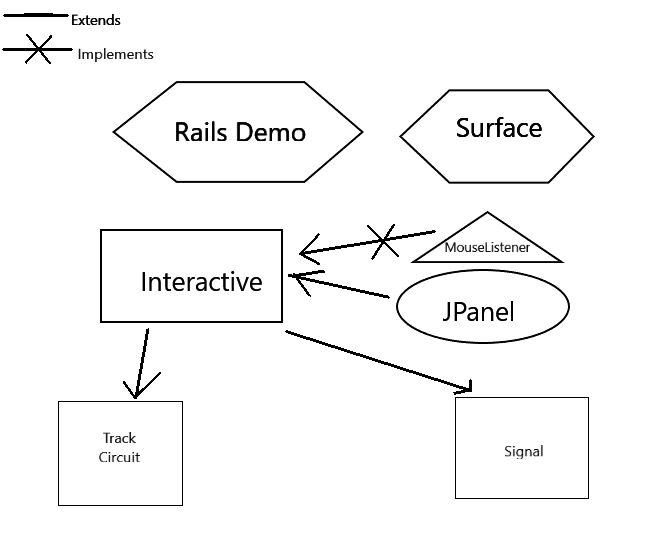

# serious-puzzle
A serious railway puzzle

Creating Scenario Display and Interaction functionality through the use of Java Graphics2D

A Scenario shall have Track Circuits(including Switches) and Signals which can be interacted with - thus creating the Interactive Class.
Signals and Switches shall get separate interaction results from a single track circuit.
