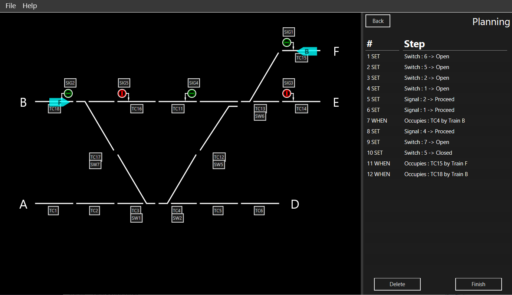

# serious-puzzle
## Scripts in [src/grzegorz/rail](src/grzegorz/rail) folder.
A serious railway puzzle

Creating Scenario Display and Interaction functionality through the use of Java Graphics2D

Above is the class diagram for the majority of the system, apart from the controller and the Animator class (which needs cleaning up).

Below is a picture of the interactive solving stage.

Below is a picture of the animation stage.
